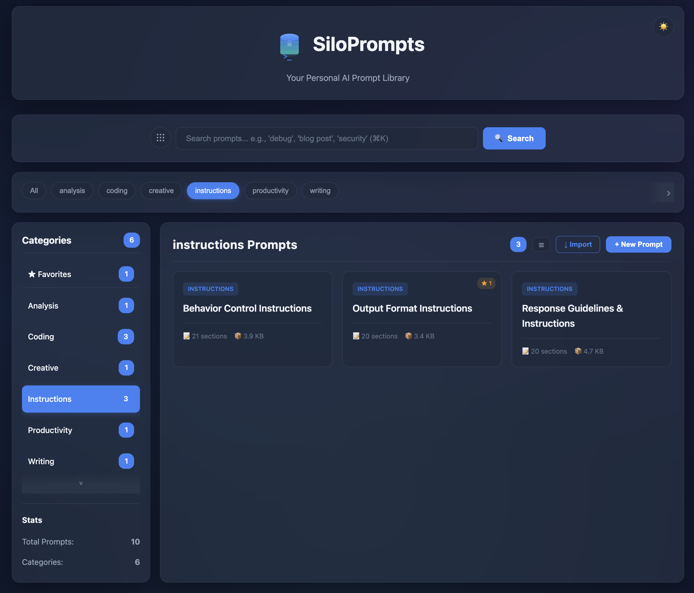
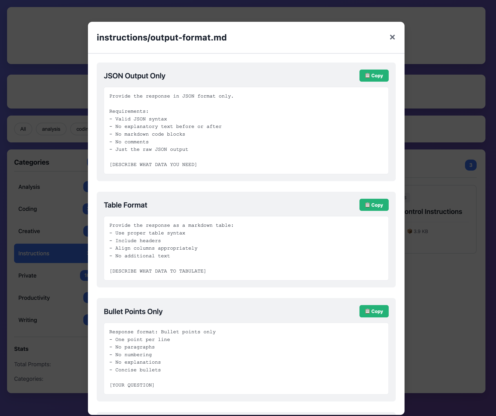

# SiloPrompts - Personal AI Prompt Database

In the GenAI era, every ask, every query, and every search is a prompt. The ones that actually work — refined through trial and error, containing your proprietary workflows — those are valuable. And most people store them in scattered notes, buried chat histories, or nowhere at all.

Cloud prompt managers exist, but they require uploading your prompts to someone else's server. Your sensitive instructions and strategies sitting on a platform you don't control.

**SiloPrompts** is a private, self-hosted prompt library. Open source. No cloud. No accounts. No data leaving your machine.

> A lightweight, self-hosted web application for storing, searching, and managing your AI prompts across different platforms (ChatGPT, Claude, Perplexity, Gemini, etc.).





## Features

- ✏️ **Full CRUD** — Create, edit, delete prompts from the web UI
- 🔍 **Full-text search** with real-time results (⌘K shortcut)
- 📋 **One-click copy** to clipboard
- 🏷️ **Tags** — Cross-category organization with multi-select filtering
- ⭐ **Section-level favorites** — Bookmark specific prompts, not just files
- 🔄 **Sort** — By name, date modified, or size
- 📥 **Import/Export** — Upload and download `.md` prompt files
- 🌗 **Dark/Light mode** with glassmorphism theme
- 🐳 **Docker-ready** with Kubernetes/Helm support
- 🔐 **Secure** — Path traversal protection, XSS escaping
- 💾 **100% local** — Markdown files, git-friendly, no database

## Quick Start

### Docker (Quickest)

```bash
docker run -d -p 5002:5000 bdharavathu/siloprompts
```

Access at http://localhost:5002

Optional: Mount your own prompts folder for persistence
```
docker run -d -p 5002:5000 -v ./prompts:/app/prompts bdharavathu/siloprompts
```

### Docker Compose

```bash
git clone https://github.com/bdharavathu/siloprompts.git
cd siloprompts
docker-compose up -d

# Access at http://localhost:5002
```

### Local Development

```bash
pip install -r requirements.txt
export FLASK_ENV=development PROMPTS_DIR=./prompts DATA_DIR=./data
python app.py

# Access at http://localhost:5000
```

## Usage

1. **Browse** prompts by category in the sidebar or filter by tags
2. **Search** using keywords — press `⌘K` to focus search instantly
3. **Click** a prompt card → view sections → **Copy** with one click
4. **Favorite** individual sections with ☆ for quick access later
5. **Create** new prompts with "+ New Prompt" or **Import** existing `.md` files
6. **Edit** prompts — add, remove, reorder sections, manage tags
7. **Export** any prompt as a `.md` file to share or backup
8. **Sort** prompts by name, date modified, or size
9. **Paste** into ChatGPT, Claude, Gemini, Perplexity, or any AI platform

### CLI Tool

```bash
python prompt-cli.py search "debug"
python prompt-cli.py list
python prompt-cli.py show coding/code-review.md
python prompt-cli.py copy coding/debugging.md 0
```

## Adding Prompts

### Via Web UI
Click "+ New Prompt", fill in the title, category, tags, and sections.

### Via Import
Click "↓ Import", select a `.md` file, choose a category, and upload.

### Via File System
Create a `.md` file in `prompts/<category>/`:

```markdown
# My Custom Prompts
Tags: python, debugging

## Prompt Name

​```
Your prompt text here with [PLACEHOLDERS] for variables.
​```

## Another Prompt

​```
Another prompt...
​```
```

## API

```
GET    /api/prompts                      # List all prompts
GET    /api/prompts/<path>               # Get prompt details
POST   /api/prompts                      # Create prompt
PUT    /api/prompts/<path>               # Update prompt
DELETE /api/prompts/<path>               # Delete prompt
GET    /api/prompts/<path>/download      # Download .md file
POST   /api/prompts/import              # Import .md file
GET    /api/categories                   # List categories
GET    /api/tags                         # List tags with counts
GET    /api/search?q=<query>             # Search prompts
GET    /health                           # Health check
```

## Kubernetes Deployment

```bash
helm install siloprompts ./helm/siloprompts
helm upgrade siloprompts ./helm/siloprompts
```

See `helm/siloprompts/values.yaml` for configuration: replicas, resources, ingress, TLS, persistent volumes.

## Configuration

Copy `.env.example` to `.env`:

```bash
FLASK_ENV=production
SECRET_KEY=your-secret-key    # python -c 'import secrets; print(secrets.token_hex(32))'
PROMPTS_DIR=/app/prompts
DATA_DIR=/app/data
PORT=5000
```

## Technology Stack

- **Backend:** Python 3.11, Flask 3.0, Gunicorn
- **Frontend:** Vanilla JavaScript, HTML5, CSS3
- **Storage:** Markdown files (no database)
- **Container:** Docker, Kubernetes with Helm

## Roadmap

- [x] Prompt CRUD from web UI
- [x] Dark/Light mode
- [x] Tags for cross-category organization
- [x] Section-level favorites
- [x] Sort, Import/Export
- [ ] Usage analytics
- [ ] Browser extension

## License

MIT License

---

**Happy Prompting!** 🚀
